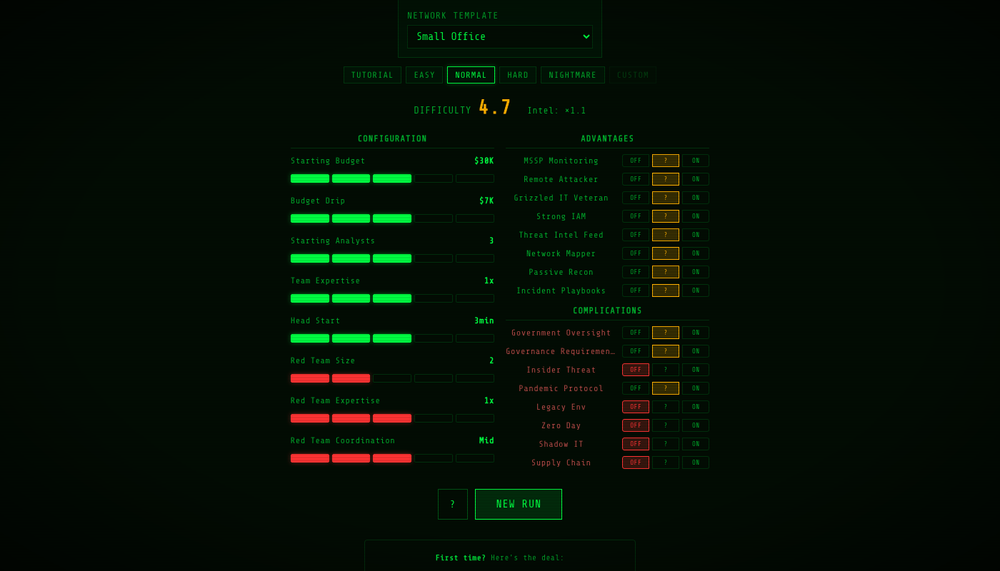
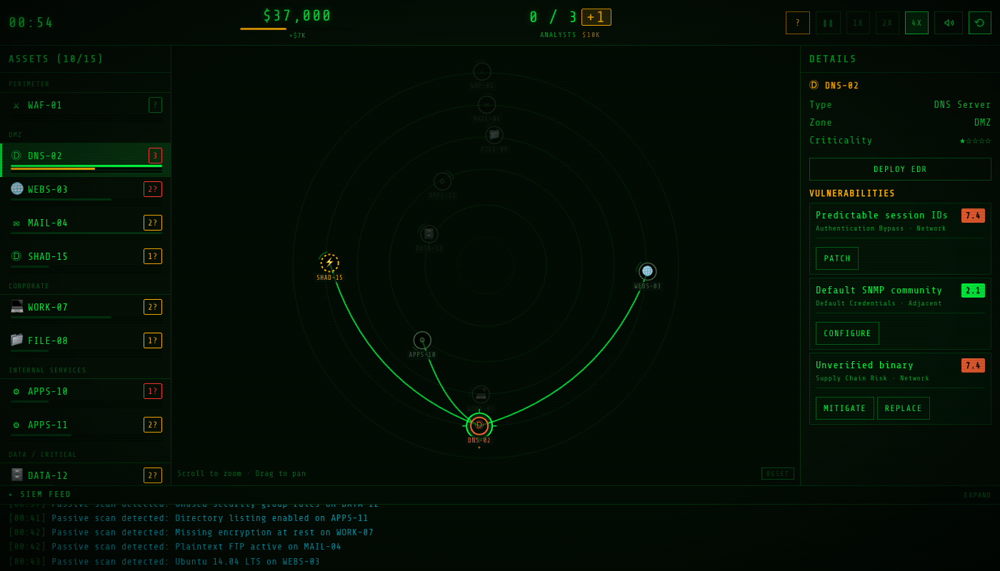
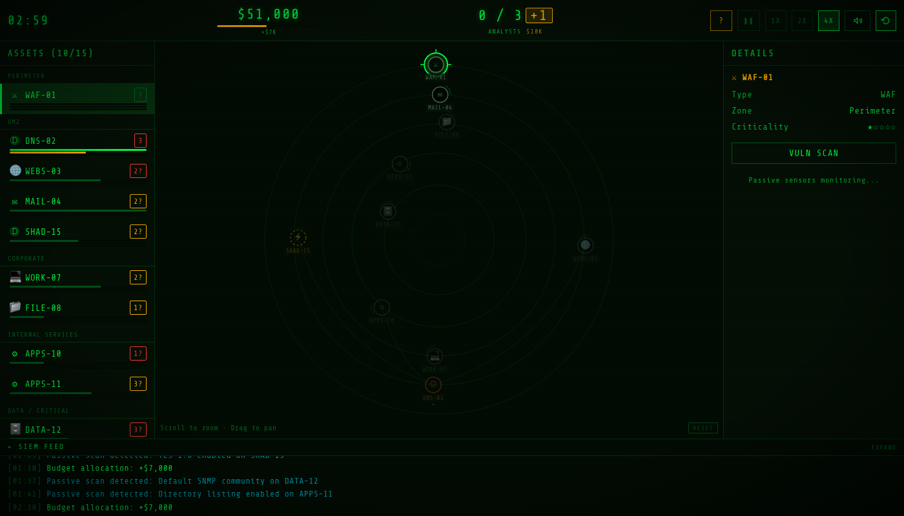
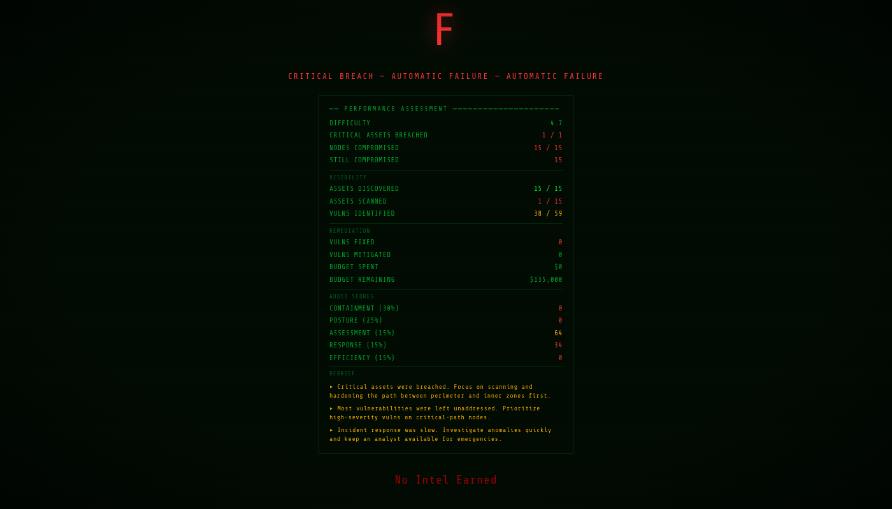

# PumaSecure

An infosec roguelike in a single HTML file. You're a security team dropped into a poorly managed network — scan assets, discover vulnerabilities, and fix them before an AI red team punches through to your critical infrastructure.

**No install. No dependencies.** Open `index.html` in any modern browser and go.

## Gameplay

You have **15 minutes** to defend a procedurally generated network while 1-5 AI pentester agents independently scan, exploit, and pivot through your infrastructure. Secure the network before they reach your critical assets, or end the engagement early by locking them out completely.

### The network

Six concentric zones, from outer perimeter to inner core:

| Zone | Examples |
|------|----------|
| Perimeter | Firewalls, WAFs, load balancers |
| DMZ | Web servers, mail gateways, DNS, VPN |
| Corporate | Workstations, file servers, printers, Wi-Fi APs |
| Internal Services | App servers, CI/CD, internal APIs, dev environments |
| Data / Critical | Databases, domain controllers, backup systems, key vaults |
| Cloud / Shadow IT | Cloud VMs, containers, SaaS apps, IoT, unmanaged devices |

The red team attacks from the outside in, but compromised Wi-Fi APs, unpatched workstations, or shadow IT can give them unexpected entry points. When locked out remotely, they may go onsite and attempt physical intrusion.

### Red team

The red team operates as **independent pentester agents** (count controlled by Red Team Size slider, 1-5). Each pentester follows a multi-step attack chain: scanning a target, exploiting vulnerabilities, then choosing between **persistence** (durable, slow) or **pivoting** (fast, fragile). They share intelligence based on the **Red Team Coordination** slider — at low coordination, each pentester only uses footholds they personally established.

Compromising key assets gives the red team lasting advantages — a VPN gateway tunnels past internal defenses, a domain controller grants credential access network-wide, a CI/CD server enables supply chain attacks.

If the red team can't break in remotely, they may send a pentester **onsite** to attack Wi-Fi APs from a coffee shop or attempt physical penetration of secured areas — risking incarceration if caught.

### Detection tiers

You can only defend what you can see. Detection depends on each node's security posture:

| Tier | Condition | What you see |
|------|-----------|-------------|
| **Tier 1** | EDR deployed | Instant, specific alerts. Compromises immediately visible. |
| **Tier 2** | Vuln scanned | Delayed, vague zone-level alerts. Compromises appear as amber **anomalies** — must investigate to confirm. |
| **Tier 3** | Unscanned / missing monitoring | Nothing. The red team owns the node and you don't know. |

Vuln scanning a silently-compromised node reveals an anomaly. EDR deployment auto-confirms the breach. The "Missing Monitoring" vulnerability forces Tier 3 regardless of scan state — fix it or stay blind.

### Scanning

- **Passive scanning** runs automatically but only detects 6 common vulnerability types (exposed services, default creds, weak crypto, misconfigs, EOL software)
- **Vuln Scan** reveals all vulns, discovers neighboring assets, and upgrades the node to Tier 2 detection — takes 15-25s and one analyst
- **Deploy EDR** reduces exploitability, uncovers shadow IT, and upgrades to Tier 1 detection — takes 20-30s and one analyst

### Fixing vulnerabilities

| Action | Speed | Effect | Risk |
|--------|-------|--------|------|
| **Mitigate** | Fast | Reduces exploitability 50-75% | Doesn't fix the root cause |
| **Configure** | Fast | Reduces severity 3-5 points | Configs get reverted, deployed to wrong host |
| **Patch** | Slow | Full fix | 70-95% success; change windows denied, dependencies break |
| **Replace** | Very slow | Near-guaranteed fix | Migrations crash, license keys reject |

Fixes can fail for realistic reasons. Failed fixes can be reworked (1.5x cost). A mitigated vulnerability can later be properly patched when resources free up. Some vuln categories (zero-days, physical security) can only be mitigated.

### Incident response

When a compromise is detected, assign an analyst to investigate. IR is a **race** against the pentester's current activity:

- **IR wins before persistence**: Attacker evicted, node hardened for 4 minutes
- **Persistence wins before IR**: Attacker has a durable foothold that survives eviction — the red team can re-enter in seconds

If persistence was established, your only option is **Burn & Rebuild** ($8-20K, 25-45s) — a scorched-earth system replacement that eliminates persistence, takes the node offline, and severs downstream red team access. The node comes back clean with zero vulnerabilities. **Costs one analyst permanently** — someone's getting fired.

### Analysts

Everything costs an analyst — scanning, fixing, investigating, rebuilding. Hire a contractor mid-run (+1, $10K) using the yellow button next to the analyst count.

### Difficulty system

The difficulty screen offers full control over game parameters:

**Sliders** (8 total):
- *Player*: Starting Budget, Budget Drip, Starting Analysts, Team Expertise, Head Start
- *Red Team*: Red Team Size, Red Team Expertise, Red Team Coordination

**Advantages** (8): MSSP Monitoring, Remote Attacker, Grizzled IT Veteran, Strong IAM, Threat Intel Feed, Network Mapper, Passive Recon, Incident Playbooks

**Complications** (8): Government Oversight, Governance Requirements, Insider Threat, Pandemic Protocol, Legacy Env, Zero Day, Shadow IT, Supply Chain

Each modifier has three positions: **OFF**, **?** (random chance), and **ON**. Five presets (Tutorial through Nightmare) configure everything, or use Custom.

### Scoring

Any critical asset (zone 4) breached at difficulty 4+ = automatic **F**. Otherwise you're graded on:

| Axis | Weight |
|------|--------|
| Containment | 30% |
| Security Posture | 25% |
| Assessment Coverage | 15% |
| Incident Response | 15% |
| Efficiency | 15% |

Grades: **S** (95+, difficulty 5+ only) / **A** (85+) / **B** (70+) / **C** (55+) / **D** (40+) / **F**

**Early win**: If you secure all discovered nodes, eliminate all compromises, and the red team has no footholds after 5 minutes, the engagement ends early.

### Career progression

Earn **Intel** based on your grade and difficulty score. Higher difficulty = higher intel multiplier. Intel is a lifetime career score that unlocks new network templates:

| Template | Intel Required |
|----------|---------------|
| Small Office | 0 (free) |
| Enterprise | 25 |
| Manufacturing | 50 |
| University | 100 |
| Hospital | 150 |
| Startup | 250 |
| Fintech | 400 |
| Government | 600 |

## Controls

| Input | Action |
|-------|--------|
| Click | Select a node |
| Double-click | Quick action (Investigate > IR > Vuln Scan > Deploy EDR) |
| Scroll | Zoom the map |
| Drag | Pan the map |
| Space | Pause / unpause |
| ? | Help |

Use the detail panel on the right to scan, fix, investigate, and rebuild.

## Tech

Single HTML file. Vanilla JS. HTML5 Canvas. No frameworks, no build tools, no external assets. CRT terminal aesthetic.

## The PumaSOC Universe

PumaSecure is the third game in the series:

- **PumaSOC** — Run your own security operations program from the comfort of your SIEM interface
- **PumaResponse** — An incident response choose-your-own-edutainment-adventure
- **PumaSecure** — Taking over vulnerability management in the middle of a red team assessment

Built by [greykit.com](https://www.greykit.com/projects)

---

## Game Theory & Design Depth

PumaSecure is built on **information asymmetry** — the defender doesn't know what they don't know. The most important resource isn't money or headcount, it's information, and every action is a bet on what matters most right now.

### The Red Team as Independent Agents

The red team isn't a timer or a random event generator. It's 1-5 independent **pentester agents**, each with their own target, state machine, and decision-making. They follow multi-step attack chains — scanning a target, exploiting vulnerabilities, then choosing between **persistence** (durable but slow) or **pivoting** (fast but fragile). Compromising key nodes grants lasting strategic buffs: a VPN gateway tunnels past defenses, a domain controller grants credential access network-wide, a CI/CD server enables supply chain attacks.

Intelligence sharing between pentesters is controlled by the **Red Team Coordination** slider. At low coordination, each pentester operates in isolation, only using footholds they personally established. At full coordination, all pentesters share all intelligence — a single foothold becomes an entry point for every operator.

### Three-Tier Detection

You can only defend what you can see. Detection quality depends on the node's security posture:

- **EDR deployed**: Instant, specific alerts. Compromises immediately visible.
- **Vuln scanned**: Delayed, vague zone-level alerts. Compromises appear as amber **anomalies** that must be investigated to confirm.
- **Unscanned / no monitoring**: Completely silent. The red team owns the node and you have no idea.

Scanning a silently-compromised node reveals the breach. The "Missing Monitoring" vulnerability becomes gameplay-critical — fix it or be blind.

### Incident Response Racing

IR isn't a guaranteed win. When you investigate a compromise, your analyst races against the pentester's current activity. If persistence completes before your IR finishes, the red team gets a durable foothold that survives eviction. Your only option then: **Burn & Rebuild** — an expensive, slow, scorched-earth system replacement that eliminates persistence but takes the node offline and costs an analyst permanently.

### Physical Intrusion

When the red team is locked out remotely, they go onsite. From a coffee shop they attack Wi-Fi APs and wireless workstations (low risk). They can also attempt **physical penetration** of secured server rooms — high reward (instant persistence via USB-jack), but failed attempts on high-security nodes risk **permanent loss of the pentester** to incarceration. Physical access vulnerabilities (unlocked server racks, no badge access) are only exploitable by onsite pentesters.

### Mid-Game Surprises

Complications like **Shadow IT** (unmanaged devices appear mid-game, discovered by the red team first) and **Supply Chain Compromise** (a backdoored dependency spawns the same critical vuln on multiple nodes simultaneously) force the player to adapt their strategy on the fly rather than execute a static plan.

### Every Mechanic Maps to Reality

Scanning = vulnerability assessment. Fixing = patch management. Detection tiers = SIEM coverage gaps. Anomaly investigation = alert triage. Persistence vs pivot = APT tradecraft. Burn & Rebuild = BCP/DR. Analyst slots = the staffing shortage every security team faces. Budget = security competing with every other business priority.

The game teaches by forcing the trade-off that defines real security leadership: **you will never have enough time, people, or money to fix everything. The question is what you fix first, and what risk you accept.**

> For the full game theory document with detailed mechanics, see [GAME_THEORY.md](GAME_THEORY.md).
